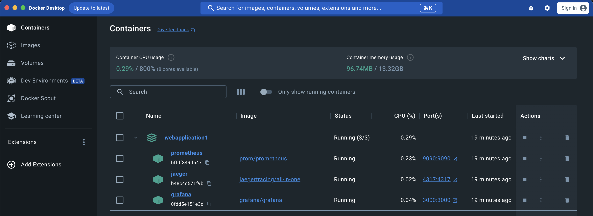
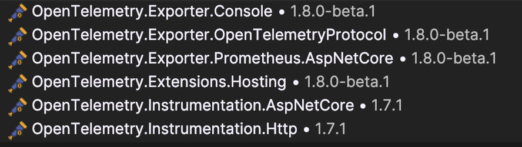
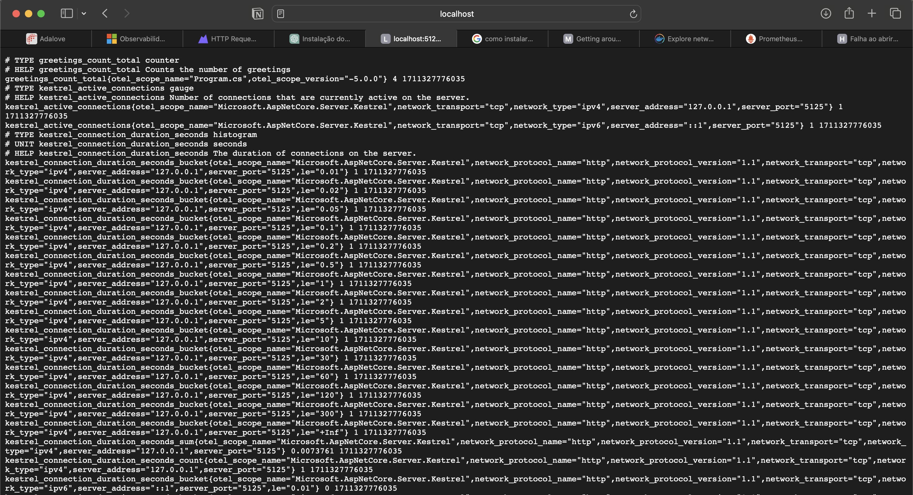
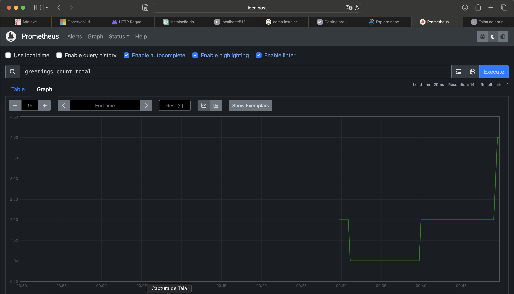
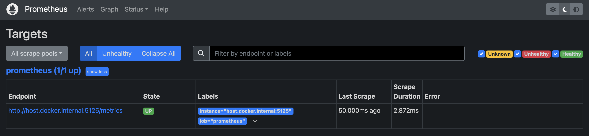
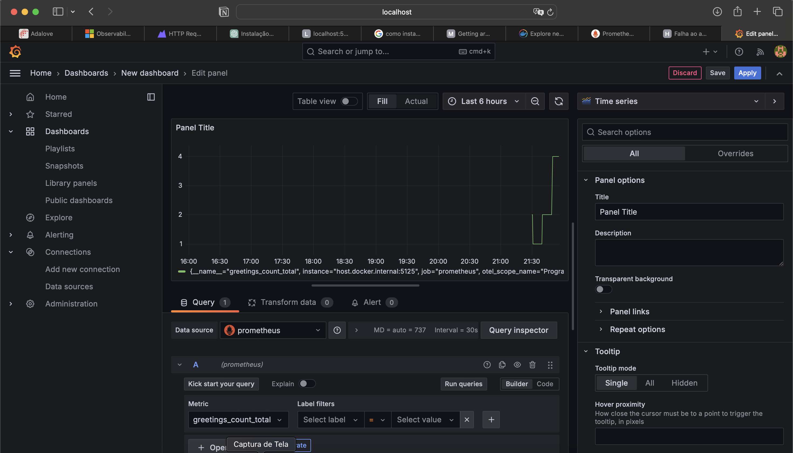
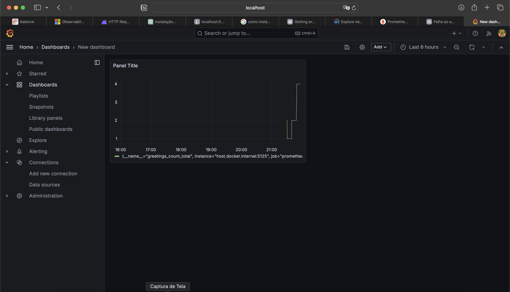
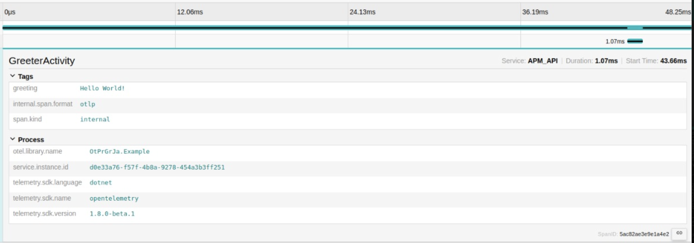

# coleta-de-metricas
## 1. tecnologias utilizadas
#### Docker: 
- Utilizado para instalar o prometheus, grafana e jaeger.
- Realizar na pasta com o arquivo "docker-compose.yml":
-     docker-compose up

#### C# 
- Linguagem utilizada para a escrita do código, na IDE Rider.
#### OpenTelemetry
- É uma biblioteca que serve para coletar e emitir dados de telemetria.
- Facilita a instrumentação de código para coletar dados de telemetria, como rastreamentos, métricas e logs.
- 
#### Prometheus
- Utilizado para a coleta das métricas.
- Resultado obtido das métricas sem o prometheus:

- Resultado obtido para visualização das métricas com o prometheus:

  
  
#### Grafana
- Utilizado para gerar dashboards e alertas com base no prometheus, por exemplo.

#### Jaeger
- Utilizado para mostrar o rastreamento distribuído.
- 
## 2. Conceitos aprendidos
### Observabilidade e sua importância
- É a capacidade de monitorar e analisar a telemetria sobre o estado de cada componente.
- Refere-se à capacidade de entender o comportamento interno de um sistema com base nos dados de entrada e saída, permitindo a detecção, diagnóstico e resolução de problemas.
- É uma combinação de 3 pilares:
    - **logs**: registram operações individuais
    - **métricas**: são contadores de medição e medidores
    - **rastreamento distribuído**: rastreia solicitações e atividades entre componentes em um sistema
      → ajuda a ver onde o tempo é gasto e a rastrear falhas

### Logs
- São registros de eventos ou mensagens geradas pelo sistema durante sua operação.
- São importantes para depuração, monitoramento e auditoria.
- A instrumentação de código pode incluir a captura e o envio de logs para armazenamento e análise, e pode ser feira através do Jaeger
### Métricas
- Elas são medidas quantitativas que fornecem insights sobre o desempenho e a saúde do sistema. Isso pode incluir métricas como tempo de resposta, taxa de erros e uso de recursos.
- No caso do exemplo desenvolvido, foi desenvolvida uma métrica que acompanha a quantidade de "Greeting" realizados ao longo do tempo.
### Rastreamento distribuído
- É uma técnica usada para monitorar e entender como as solicitações são processadas em sistemas de software distribuídos.
- Permite acompanhar o caminho que uma solicitação segue através de diferentes serviços e componentes, fornecendo uma visão detalhada do fluxo de trabalho e identificando possíveis gargalos ou problemas de desempenho.
- É essencial para diagnosticar e solucionar problemas em sistemas distribuídos complexos, garantindo uma experiência confiável para os usuários finais.
